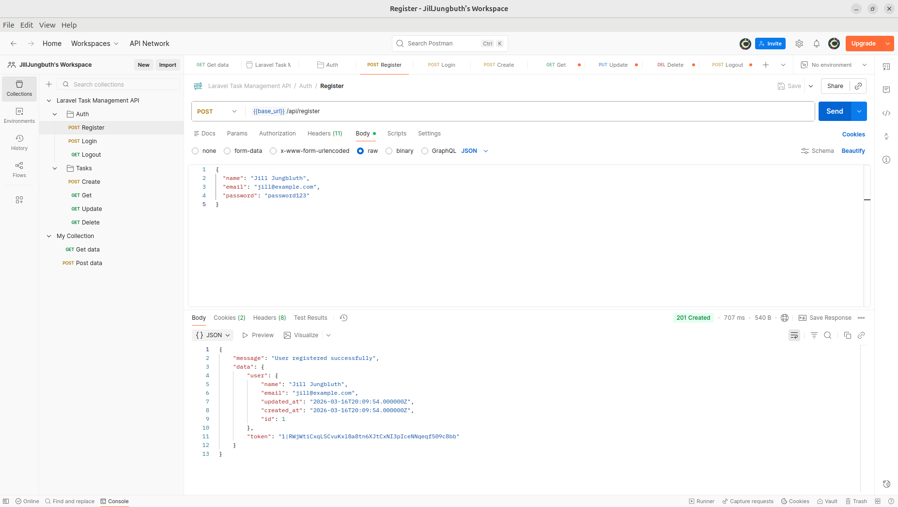
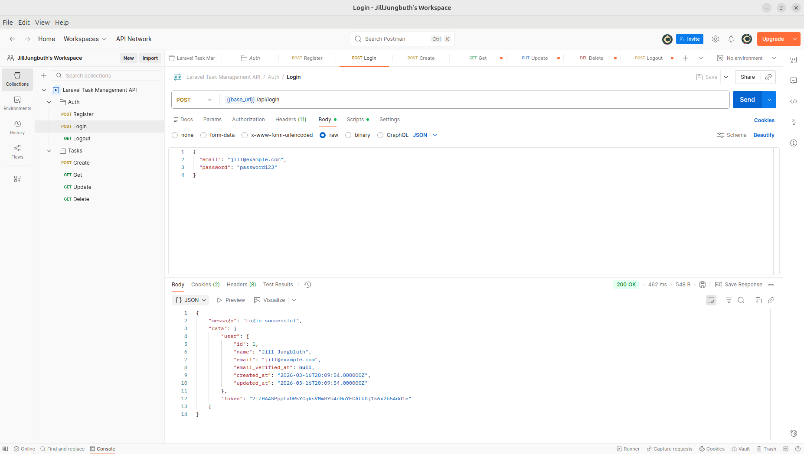
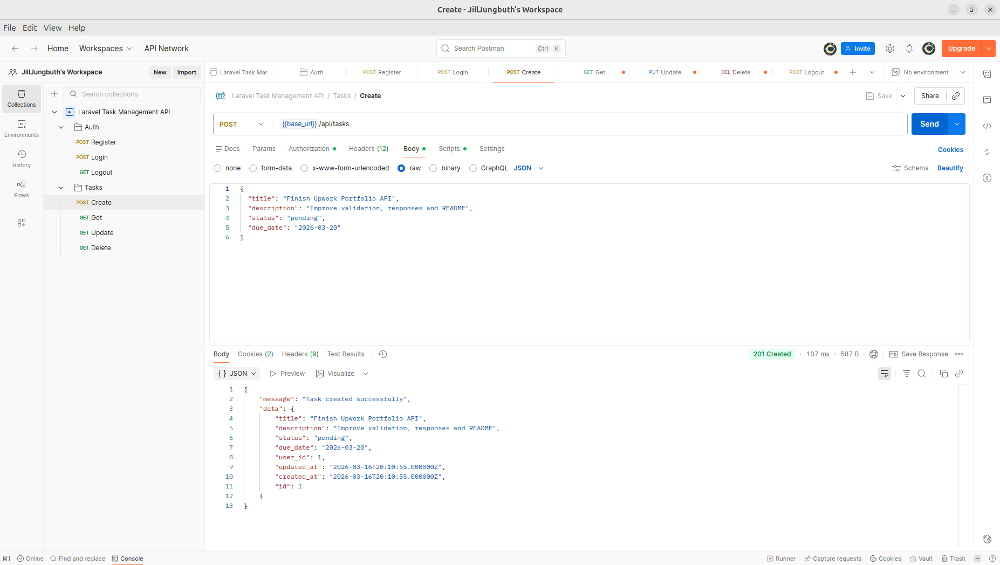
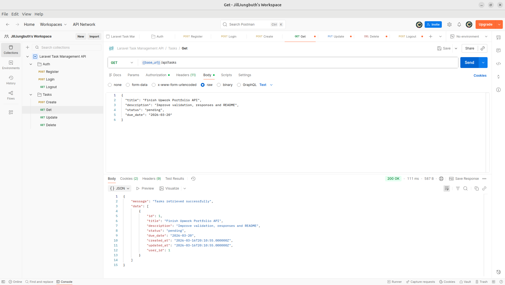
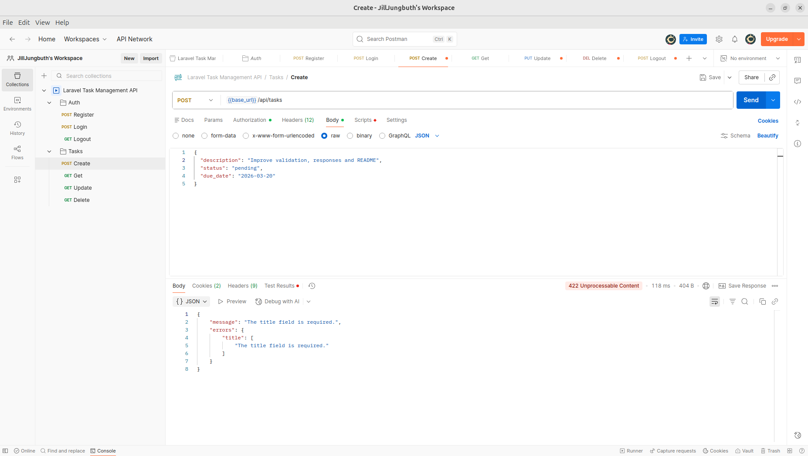
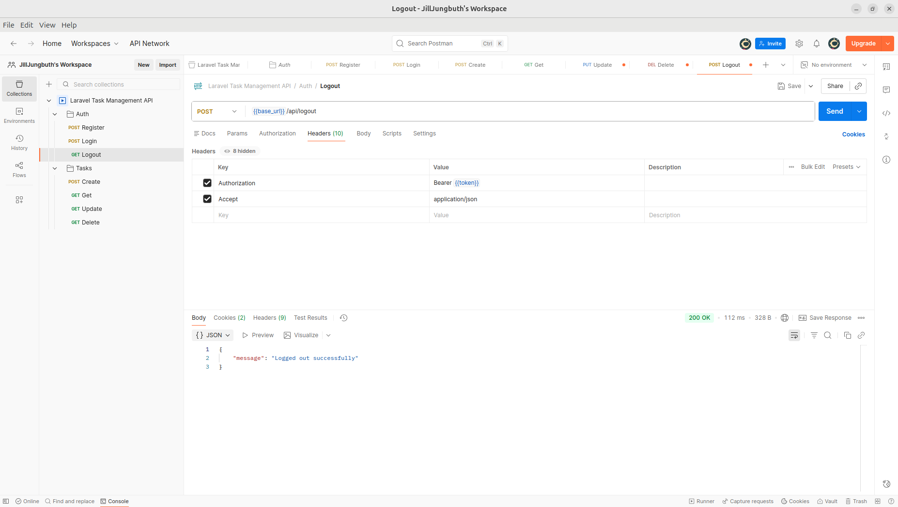
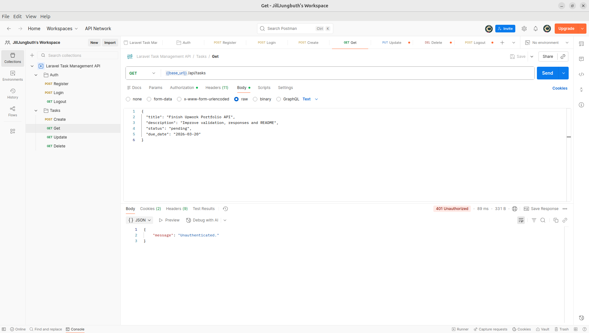

# Laravel Task Management REST API

A RESTful API built with **Laravel** for managing tasks with **token-based authentication using Laravel Sanctum**.

This project demonstrates a complete **authentication flow and CRUD operations** for a task management system.

---

# Features

- RESTful API built with Laravel
- Token authentication using Laravel Sanctum
- User registration and login
- CRUD operations for tasks
- User-specific task ownership
- JSON API responses
- Request validation and error handling
- Postman collection for easy API testing

---

# Tech Stack

- **Laravel**
- **Laravel Sanctum**
- **MySQL**
- **Postman (API testing)**

---

# API Endpoints

## Authentication

| Method | Endpoint | Description |
|------|------|------|
| POST | `/api/register` | Register a new user |
| POST | `/api/login` | Login and receive API token |
| POST | `/api/logout` | Logout and revoke token |

## Tasks

| Method | Endpoint | Description |
|------|------|------|
| GET | `/api/tasks` | Get all tasks for authenticated user |
| POST | `/api/tasks` | Create a new task |
| PUT | `/api/tasks/{id}` | Update a task |
| DELETE | `/api/tasks/{id}` | Delete a task |

---

# Authentication

This API uses **Laravel Sanctum** for token-based authentication.

After logging in, include the token in the request header:

```http
Authorization: Bearer YOUR_TOKEN
```

Example login response:

```json
{
  "message": "Login successful",
  "data": {
    "user": {
      "id": 1,
      "name": "Jill Jungbluth",
      "email": "jill@example.com"
    },
    "token": "1|exampleapitoken..."
  }
}
```

---

# Task Structure

Example task object returned by the API:

```json
{
  "id": 1,
  "title": "Finish Upwork Portfolio API",
  "description": "Improve validation, responses and README",
  "status": "pending",
  "due_date": "2026-03-20",
  "created_at": "2026-03-16T16:46:14.000000Z",
  "updated_at": "2026-03-16T16:46:14.000000Z"
}
```

---

# Example Requests

## Register

```
POST /api/register
```

```json
{
  "name": "Jill Jungbluth",
  "email": "jill@example.com",
  "password": "password123"
}
```

---

## Login

```
POST /api/login
```

```json
{
  "email": "jill@example.com",
  "password": "password123"
}
```

---

## Create Task

```
POST /api/tasks
```

```json
{
  "title": "Finish Upwork Portfolio API",
  "description": "Improve validation, responses and README",
  "status": "pending",
  "due_date": "2026-03-20"
}
```

---

## Update Task

```
PUT /api/tasks/{id}
```

```json
{
  "title": "Finish Laravel Portfolio API",
  "status": "in_progress",
  "due_date": "2026-03-22"
}
```

---

## Delete Task

```
DELETE /api/tasks/{id}
```

---

# Validation Error Example

Example response when validation fails:

```json
{
  "message": "The selected status is invalid.",
  "errors": {
    "status": [
      "The selected status is invalid."
    ]
  }
}
```

---

# API Screenshots

### User Registration



---

### User Login



---

### Create Task



---

### Get Tasks



---

### Validation Error



---

### User Logout



---

### Unauthenticated



---

# Installation

## Clone the repository

```bash
git clone https://github.com/jilljungbluth-dev/laravel-task-management-api.git
cd laravel-task-management-api
```

---

## Install dependencies

```bash
composer install
```

---

## Copy environment file

```bash
cp .env.example .env
```

---

## Generate application key

```bash
php artisan key:generate
```

---

## Configure database

Update your `.env` file with your database credentials.

Example:

```
DB_DATABASE=task_api
DB_USERNAME=root
DB_PASSWORD=
```

---

## Run migrations

```bash
php artisan migrate
```

---

## Start development server

```bash
php artisan serve
```

The API will be available at:

```
http://127.0.0.1:8000
```

---

# Postman Collection

A ready-to-use **Postman Collection** is included in this repository for testing the API.

You can import it directly into Postman.

```
postman/laravel-task-management-api-postman-collection.json
```

---

# License

This project is open-source and available under the MIT License.